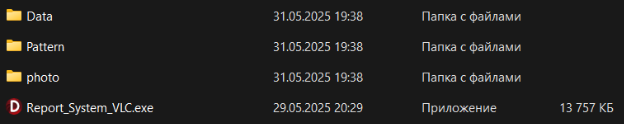
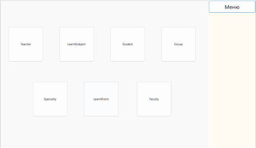
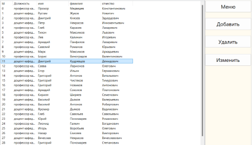
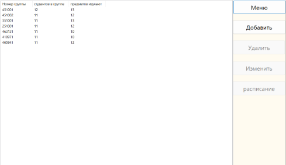
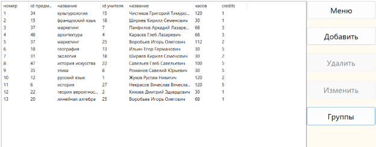
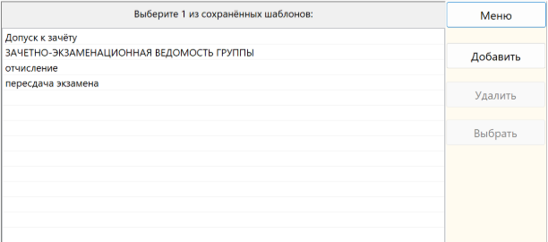
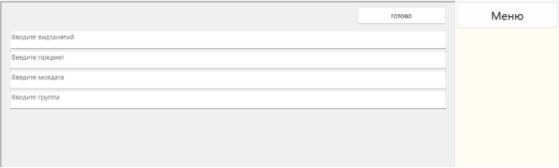
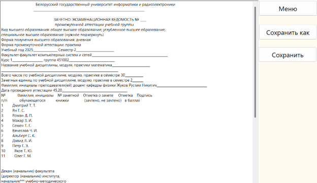

Это курсовая работа написанная на Delphi. Её суть заключается в том чтобы была база данных студентов, преподователей, кто какие предметы ведёт, система групп и не только. Одно из требований чтобы эта базза данных была расширяемая внутри программы с помощью GUI, а так же возможность удаления и редактирования. Кроме базы данных было необходимо реализовать систему которая по специальным значениям в txt файлах, а именно по тексту заключённому в $ $ из базы данных подтягивались нужные данные. То-есть пользователь выбирает файл, вписывает в моей программы минимальный требуемый набор данных чтобы заполнить этот файл и по итогу получает заполненный файл.

Руководство пользователя:

Рисунок 5 – вебсайт для скачивания

В Окошке по центру в разделе «Assets» нажмите на синий текст «Source code (zip)». После начнётся скачивание.

После завершения скачивания найдите этот файл. Обычно в проводнике он находится первым в разделе «Загрузки». Откройте его с помощью любой программы разархиватора. Разархивируйте этот файл. В полученной папке должны находиться эти файлы:

Рисунок 6 – скаченные файлы
### Как использовать программу.

После загрузки программы появится следующее окно:

Рисунок 7 – загрузочное окно

Если нажать на кнопку «База данных» появится следующее окно.

Каждая кнопка откроет свою базу данных. Первые 3 — это списки всех учителей, изучаемых предметов и студентов соответственно. Доступные действия — это добавления, удаления, редактирование. Длина списков не ограничена. Эти списки будет выглядеть подобным образом:

Рисунок 8 – список учителей

Если зайти в группы там будет доступно добавление и удаление групп, а также можно просмотреть дополнительное расписание для каждой группы, если нажать на нужную группу и после нажать на кнопку «расписание». В этом расписании отображается какие предметы изучает группа и какие преподаватели ведут этот предмет, а также количество часов на изучение этого предмета в семестре и дополнительная информация о предмете. В любой момент можно вернуться назад нажав на кнопку «группа».

Рисунок 9 – список группы. 

Рисунок 10 – дополнительное расписание группы.

3 остальных списка даны в основном для справки, но их так же всех можно изменять.

Создание шаблонов.

После нажатия кнопки «создать шаблон» в главном меню вы попадёте в это окно и перед вами будут показаны все добавленные шаблоны. Вы можете добавить свой любой шаблон, который является txt файлом, так же можно удалить или выбрать шаблон для создания документа. 

Рисунок 11 – список сохранённых шаблонов.

После надо будет ввести в появившиеся поля данные, которые есть в базе данных и нажать на кнопку готово. Если данные не будут найдены то поле будет красным иначе зелёным.

Рисунок 12 – ввод данных для создания документа.

\
`	`При добавлении своего шаблона необходимо, чтобы он соответствовал этим требованиям. 

- любая "строка для вставки" должна находиться между двумя долларами ($ \*текст\* $). 
- любая "строка для вставки" должна находиться на одной строчке и не переносится.
- У каждой "строки для вставки" есть свой приоритет, если до этого не было найдено ничего что могло определить что надо вставить в эту строку для вставки то она запрашивается у пользователя.
- Нельзя делать вложенные друг в друга "строки для вставки"
- Любой текст между 2 долларами будет проверяться на "строку для вставки"
- Регистр букв в "строке для вставки" не важен.

5\. Поддерживаемые placeHolders:

`$ФИО$   – ФИО студента в родительном падеже, вводе для программы используются 3 слова имя, фамилия, отчество.`

`$деканД$ – имя декана в дательном.`

`$допФИО$ – любое ФИО, всегда спрашивается, так же стоит использовать для вставки любой строки в любое место  `

`$группаФИО$ – ФИО всей группы, каждое ФИО с новой строки, пронумерованные`

`$группа$  –  номер группы `

`$семестр$   $курс$ `

`$факульт$  – факультет`

`$спец$ – специальность  `

`$предмет$  – учебный предмет  `

`$ПФИО$  – ФИО преподавателя и его должность`

`$дата$ – дата создания документа`

`$год$	 – год создания документа`

`$мояДата$ – ввести дату мероприятия`

`$формаОбучения$ – форма обучения в соответствии с группой`

`$пересдач$  – любое число`

`$телефон$  – номер телефона `

`$часов$`

`$зачЕдин$`

`$инициалы$ – фамилия и первые буквы имени и отчества студента.`

После создания документа вы можете его сохранить в формате txt либо в стандартную папку с помощью кнопки «Сохранить» или самостоятельно выбрать место для сохранения файла выбрав кнопку «Сохранить как».

Рисунок 13 – полученный документ

